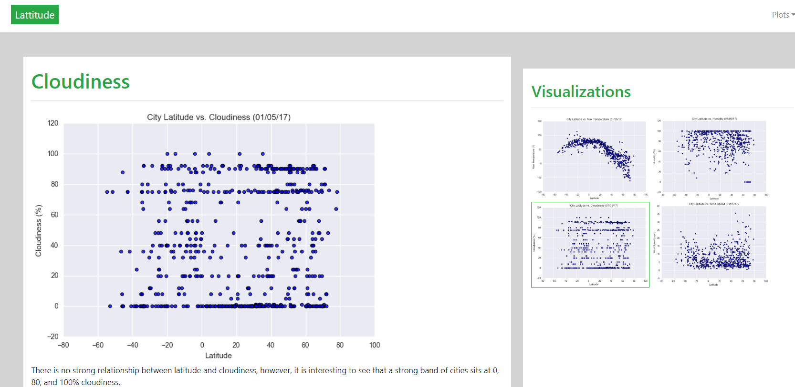

# HW12---Web-Visualization-Dashboard

## Objective
The goal is to visualize the result of the Weather Analysis (HW6) using html/css/bootstrap.

## Presentation
Below is the snapshots of the webpages. Please use the link [here](https://zl14e161110.github.io/HW12---Web-Visualization-Dashboard/) to review the webpages.

#### Landing page

#### Comparison page

#### Data page

#### Visualization page - Latitude vs. Max Temp

#### Visualization page - Latitude vs. Humidity

#### Visualization page - Latitude vs. Cloudiness

#### Visualization page - Latitude vs. Wind Speed

